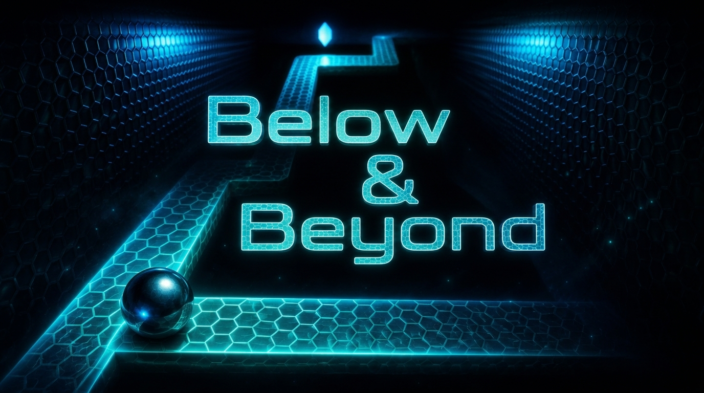
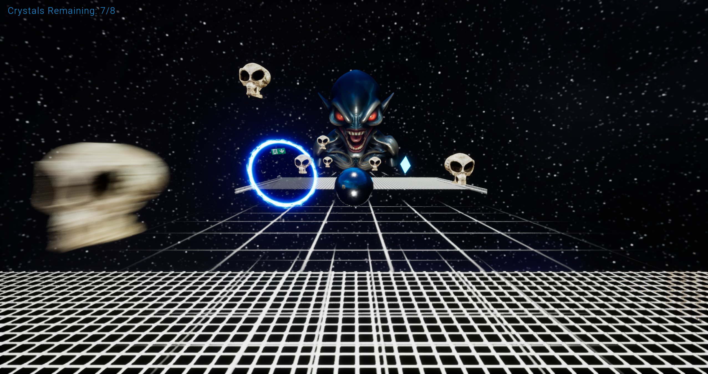

# Below & Beyond

A two-level 3D platformer built solo in Unreal Engine. Roll through an underground gauntlet and out into space, collecting crystals while avoiding cannons, saws, alien skulls, and a giant alien boss.

**[Click to Play!](https://bbat2575.itch.io/below-and-beyond)**

## About

A short platformer built solo in Unreal Engine 5.4 using Blueprint scripting - from gameplay systems design to full spatial audio implementation. It features physics-based movement, hazard and enemy design, a boss encounter, dynamic sound design, custom asset editing and integration in Blender, and a complete player experience from splash screen through live HUD.

## Features
- **Immersive level design** - from deep underground exploration to the vastness of open space
- **Physics-based ball movement** - with responsive controls across various terrains and obstacles
- **Hazards** - firing cannons, rotating saws, and spooky alien skulls
- **Boss encounter** - a giant alien firing projectiles in space
- **Crystal collection scoring** - with a live HUD tracking crystals remaining
- **Win/lose states** - progress on completion and restart on death
- **Colourful atmospheric lighting** - bringing each level to life
- **Full spatial audio implementation** - dynamic rolling sounds, collision-triggered impacts, distance-based sound attenuation, and looping ambient/music tracks

## Controls

| Input | Action |
|:------|:-------|
| `W` `A` `S` `D` | Move the ball |

## Built With
- Unreal Engine 5.4
- Blueprints (visual scripting)
- Blender (asset editing)

## Assets & Credits

Some 3D models used in this project were sourced from [Fab](https://www.fab.com) under the Standard License and Creative Commons Attribution (CC BY 4.0) license.

**CC BY 4.0 Attributions:**
- "Alien Skull" by anthroterrie, sourced from [Fab](https://fab.com/s/0873501cf097), licensed under [CC BY 4.0](https://creativecommons.org/licenses/by/4.0/)
- "Alien Monster Vintage" by Andrin Sky, sourced from [Fab](https://fab.com/s/317c1584f3d8), licensed under [CC BY 4.0](https://creativecommons.org/licenses/by/4.0/)
- "Portal Travel" by FenixFX, sourced from [Fab](https://fab.com/s/07ae82ef0ce6), licensed under [CC BY 4.0](https://creativecommons.org/licenses/by/4.0/)

## Screenshots

